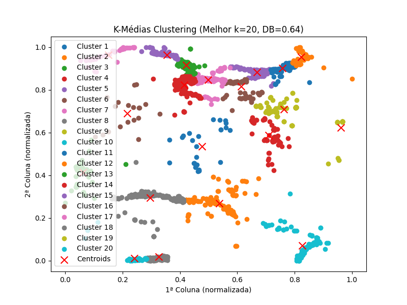
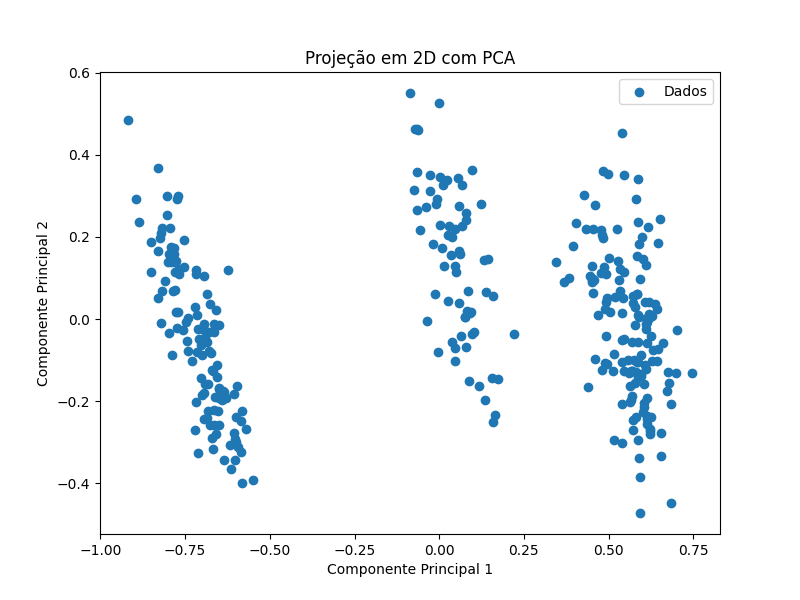
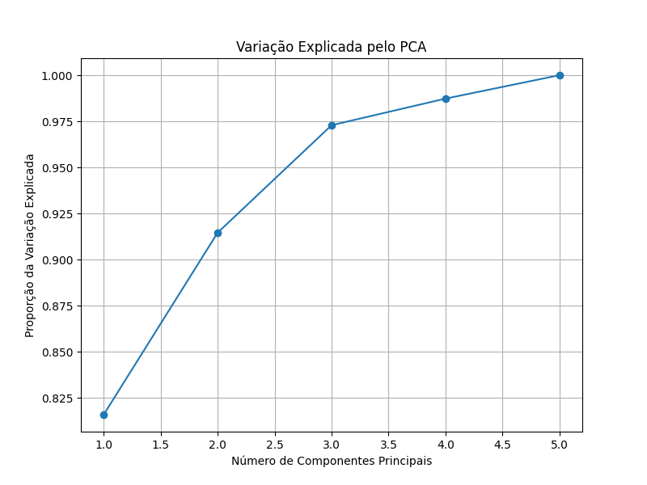

# Ciência da Computação  
**Instituto Federal do Ceará**  
**Campus Maracanaú**  

**Professor**: Hericson Araújo  
**Disciplina**: Reconhecimento de Padrões  
**Aluno**: Francisco Aldenor Silva Neto
**Matrícula**: 20221045050117

---

# **6ª Lista de Exercícios: K-Médias e PCA**

---

## **1. Introdução**

Nesta atividade, abordamos dois importantes métodos de aprendizado não supervisionado e análise de dados: **K-Médias** e **PCA (Análise dos Componentes Principais)**.  
- O algoritmo **K-Médias** foi aplicado ao conjunto de dados de terremotos (quake.csv) para agrupar pontos geográficos com base na distância Euclidiana, avaliando a qualidade dos agrupamentos pelo índice Davies-Bouldin (DB).  
- O **PCA** foi utilizado para reduzir a dimensionalidade do conjunto de dados de pinguins (penguins.csv), projetando os dados em 2 dimensões e analisando a variação explicada por diferentes números de componentes principais.  

Os resultados obtidos destacam a aplicabilidade de ambas as técnicas na identificação de padrões e na visualização de dados complexos.

---

## **2. Metodologia**

### **2.1. Dados de Terremotos (quake.csv)**

1. **Pré-processamento**:  
   - Os dados contendo **latitudes** e **longitudes** foram normalizados para evitar a influência de escalas diferentes.
   
2. **K-Médias**:  
   - Implementação do algoritmo K-Médias utilizando a **distância Euclidiana**.  
   - Testamos diferentes números de clusters, variando de **4 a 20**, para identificar o número ideal de grupos com base no menor valor do índice **Davies-Bouldin (DB)**.  
   - Para cada valor de clusters (k), o algoritmo foi executado **20 vezes** para minimizar erros devido à inicialização aleatória.

---

### **2.2. Dados de Pinguins (penguins.csv)**

1. **Pré-processamento**:  
   - Os dados foram normalizados e as colunas categóricas foram tratadas adequadamente.  
   
2. **Projeção com PCA**:  
   - Aplicamos o PCA para projetar os dados em 2 dimensões, utilizando os dois primeiros componentes principais.  
   - Calculamos a **variação explicada acumulada** para dimensões de 1 a 4, avaliando a contribuição de cada componente principal.

---

## **3. Resultados**

### **3.1. K-Médias com quake.csv**

#### **Resultados do Melhor Modelo de K-Médias**

| **Melhor valor de k**       | **Índice Davies-Bouldin (DB)** | **Erro de Reconstrução** |
|-----------------------------|---------------------------------|---------------------------|
| 20                          | 0.6351                         | 5.6950                   |

#### **Centróides Finais (Coordenadas Normalizadas)**

| **Cluster** | **Latitude** | **Longitude** |
|-------------|--------------|---------------|
| 1           | 0.47657274   | 0.53477444    |
| 2           | 0.5370866    | 0.26922215    |
| 3           | 0.06120216   | 0.41462307    |
| 4           | 0.70928956   | 0.58824364    |
| 5           | 0.66853975   | 0.88344241    |
| ...         | ...          | ...           |
| 20          | 0.82723673   | 0.07213224    |

#### **Distribuição dos Elementos por Cluster**

| **Cluster** | **Quantidade de Elementos** |
|-------------|------------------------------|
| 1           | 27                           |
| 2           | 126                          |
| 3           | 57                           |
| ...         | ...                          |
| 20          | 50                           |

#### **Gráficos Gerados**

**Dispersão dos Clusters no Espaço Geográfico**  

---

### **3.2. PCA com penguins.csv**

#### **Variação Explicada Acumulada**

| **Número de Componentes** | **Variação Explicada (%)** |
|---------------------------|---------------------------|
| 1                         | 74,67                    |
| 2                         | 93,81                    |
| 3                         | 98,23                    |
| 4                         | 99,78                    |

#### **Projeção 2D utilizando os dois primeiros Componentes Principais**

#### **Variação Explicada Acumulada (Gráfico)**  

---

## **4. Conclusões**

1. **K-Médias**:  
   - O número ideal de clusters foi **k=20**, com base no índice Davies-Bouldin (DB).  
   - A execução do K-Médias demonstrou a importância da inicialização adequada e do número ideal de clusters para a qualidade dos agrupamentos.  

2. **PCA**:  
   - A redução da dimensionalidade com PCA mostrou que os dados podem ser projetados em **duas dimensões**, preservando mais de 93% da variância.  
   - O PCA é uma ferramenta eficiente para visualização e compreensão dos dados, mesmo em conjuntos multidimensionais.  

3. **Considerações gerais**:  
   - Ambas as técnicas desempenham papéis complementares na análise de dados: o K-Médias para agrupamento e o PCA para redução de dimensionalidade e visualização.  
   - Os resultados refletem a eficácia de métodos de aprendizado não supervisionado na exploração e interpretação de padrões em conjuntos de dados.

